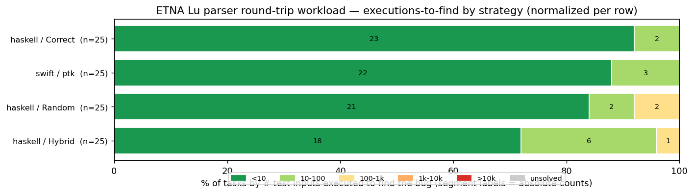
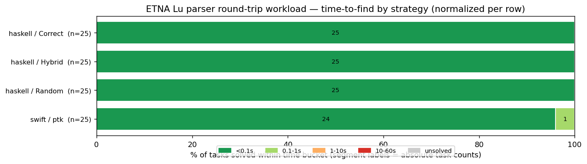

# etna-swift-luparser

A **Lu parser / pretty-printer round-trip workload for
[ETNA](https://github.com/alpaylan/etna-cli)**, implemented in **Swift** with
**[PropertyTestingKit](https://github.com/doordash-oss/PropertyTestingKit)**
(PTK) as a **coverage-guided** testing strategy.

It is a faithful port of ETNA's reference Lu workload (the UPenn-CIS5520-derived
parser mirrored by
[etna-haskell-luparser](https://github.com/alpaylan/etna-haskell-luparser)): the
same `Block`/`Statement`/`Expression`/`Value` AST, the same applicative
parser-combinator library, the same `Text.PrettyPrint`-style pretty-printer with
its operator-precedence parenthesization, the same round-trip property, and the
same source-swap mutants. The novelty is the **strategy**: PTK drives the search
with **edge-coverage feedback** over a **bespoke parsable-AST generator**.

This is the fifth Swift/PTK ETNA workload, after
[etna-swift-bst](https://github.com/twof/etna-swift-bst),
[etna-swift-rbt](https://github.com/twof/etna-swift-rbt),
[etna-swift-stlc](https://github.com/twof/etna-swift-stlc), and
[etna-swift-fsub](https://github.com/twof/etna-swift-fsub). Where those four are
data-structure-invariant or type-preservation workloads, this one is a different
flavor entirely: a **parser round-trip**, `parse(pretty(ast)) == ast`. The bugs
live in the parser and pretty-printer (whitespace handling, string-literal
edges, operator precedence, keyword structure), not in a substitution or
rebalancing routine.

## The workload

- **AST**: `Block` = `[Statement]`; statements (`Assign`/`If`/`While`/`Repeat`/
  `Empty`); expressions (`Var`/`Val`/`Op1`/`Op2`/`TableConst`) with unary &
  binary operators and a precedence `level`; values (`nil`/int/bool/string);
  table-indexing variables (`x`, `t.k`, `t[e]`).
- **Parser**: a small applicative/alternative combinator library (`Parser.swift`)
  plus the Lu grammar (`Lang.swift`) — `wsP`/`stringP`, value/operator/name
  parsers, precedence-climbing `expP`, `statementP`, `blockP`.
- **Pretty-printer**: renders an AST back to source. Layout is simplified to
  single-space separation (the parser is whitespace-insensitive), but the
  **operator-precedence parenthesization is ported faithfully** — that is the
  part the round-trip depends on.
- **Properties** (`Bool?` — `nil` discards a non-parsable input):
  `roundtrip_val`, `roundtrip_exp`, `roundtrip_stat`.
- **11 mutants**, all structural parser/pretty-printer bugs: missing trailing-
  whitespace consumption (`wsP_1`, `stringP_1`, `boolValP_1`), string-literal
  edges (`stringValP_1`…`stringValP_4`), operator-ordering (`bofP_1`: `>` before
  `>=`), name lexing (`nameP_2`: no digits), keyword structure (`statementP_1`:
  `if` without `end`), and pretty-printing (`ppNot_1`: `not` → `nil`).

The property holds for the clean implementation, so every parsable AST
round-trips and a mutant is witnessed only by an input that exercises the broken
path.

### Only the witnessable tasks are benchmarked (25 of 33)

A `(mutant, property)` pair is included only if a round-trip witness can actually
distinguish it — **25 tasks across 11 mutants**. The unlisted pairs are
genuinely unwitnessable: `ppNot`/`bofP`/`stringP`/`boolVal` never affect a bare
*value*; `statementP_1` (`if` without `end`) only surfaces with nested blocks, so
only `roundtrip_stat` catches it. The reference's `reserved_*` and `nameP_1`
mutants are **omitted entirely**: catching them needs a name equal to or
containing a reserved word, which the round-trip precondition
`doesNotContainReservedWords` excludes — so they are unwitnessable under this
property (this is why the upstream Haskell workload, which wired only
`reserved_1/2/3`, was marked "needs tuning"). `tableConstP_1` is omitted because
it does not type-check in the Haskell reference.

### Differential validation against the Haskell reference

Beyond "the property passes on clean", the port is validated against the
independent Haskell reference with a **cross-parse oracle**. For each AST `t` in
a shared 4,525-term corpus (1.5k generated per kind + the 25 witnesses), the
`luparser-diff` helper and the matching `diff-oracle` in
[etna-haskell-luparser](https://github.com/alpaylan/etna-haskell-luparser) check
both directions:

```bash
# Haskell's reference parser must recover t from THIS port's rendering, and
# Swift's parser must recover t from the Haskell reference's rendering.
luparser-diff pretty exp  < corpus.txt | diff-oracle reparse exp   # == t ?
diff-oracle  pretty exp  < corpus.txt | luparser-diff reparse exp  # == t ?
```

Verified: **0 mismatches across all 4,525 terms in both directions** — the Swift
parser *and* pretty-printer are mutually compatible with the independent Haskell
implementation, despite different layout algorithms. And activating each mutant
in both via marauder, **all 25 Swift-harvested witnesses are also caught by the
corresponding Haskell mutant** — the mutant bodies are faithful too.

### The generator

`Sources/LuParserGen/` ports the reference's **bespoke size-controlled
generator** (`Strategy/Correct.hs`): names drawn from a fixed reserved-word-free
pool, string literals from printable non-quote characters, so it produces
*parsable* ASTs by construction (≈100% yield — discards are negligible). PTK
layers edge-coverage feedback and a seed set that targets each mutated path.

## Benchmark

Cross-engine sweep over the **25 tasks**, `timeout=10s`, `trials=1`, run with
ETNA against the reference workload's three Haskell strategies (its only
strategies). Lu has no Rust port.

| Strategy | Solved | Executions-to-find (median / max) |
|---|---:|---|
| **swift / ptk** | **25/25** | **3 / 10** |
| haskell / Correct (bespoke gen) | 25/25 | 2 / 87 |
| haskell / Hybrid | 25/25 | 3 / 201 |
| haskell / Random (generic) | 25/25 | 3 / 856 |

**This is an "easy" workload, and that is the finding.** Unlike the
type-preservation workloads (Fsub/STLC), where only a type-directed generator
ever builds a valid input and random/enumerative strategies solve nothing, Lu's
structural round-trip mutants are shallow enough that **every strategy — even
generic `Random` — solves all 25 tasks**.

On **wall-clock time**, swift / ptk is the **slowest** of the four — it is the
only strategy with a task taking over 0.1s (0.10s), running ≈0.02–0.10s per
task, whereas all three Haskell strategies finish every task in ≈1–9ms. PTK's
parallel-engine + coverage-instrumentation startup is pure overhead on a
workload where a bug falls out in the first handful of inputs.

The one axis where the coverage-guided + seeded approach helps is the **tail of
the executions-to-find distribution**. swift / ptk needed **at most 10 inputs**
for any task (22 of 25 in fewer than 10, the other 3 at exactly 10), whereas
`Random` tails out to **856** inputs, `Hybrid` to 201, and `Correct` to 87. Note
this is *only* a worst-case effect: on the common case `Correct` actually solves
slightly more tasks in under 10 inputs (23 vs 22). The seeds pin each mutated
path and coverage feedback bounds the search, so ptk has no long tail — but it
pays for that machinery in wall-clock time, and on a workload this shallow the
tail barely matters.





Caveat (as with the BST/RBT/STLC/Fsub ports): swift / ptk is the only
coverage-guided strategy here, and — like `Correct` — uses a bespoke valid-input
generator. The comparison isolates *search strategy over the same generator
family*, not generator quality; and on a workload this shallow, solve-rate
saturates for everyone.

## Layout

| Path | Role |
|---|---|
| `Sources/LuParser/` | System under test: AST (`Syntax.swift`), parser-combinator library (`Parser.swift`), the Lu grammar + pretty-printer + the 11 mutants (`Lang.swift`), the round-trip spec (`Spec.swift`), and the wire (de)serializer (`Wire.swift`). Instrumented with `-sanitize-coverage`. |
| `Sources/LuParserGen/` | PTK-backed bespoke parsable-AST generator + coverage-guided `solve(...)` / `sample(...)`. |
| `Sources/Solve/` | The `luparser` executable (ETNA `solve`). Dir is `Solve`, not `luparser`, to dodge a case-insensitive-filesystem clash with `LuParser`. |
| `Sources/luparser-sampler/` | The `luparser-sampler` executable (ETNA `sample`). |
| `Sources/luparser-diff/` | Differential-oracle helper (`pretty` / `reparse` / `roundtrip`) for cross-checking against the Haskell reference. |
| `Tests/LuParserTests/` | Round-trip oracle on clean, generator-parsability invariant, wire round-trip, and the 25 harvested witnesses verified on clean. |
| `etna.toml`, `steps.json` | ETNA workload manifest (25 tasks) + capability protocol. |
| `marauder.toml` | Registers Swift as a marauder custom language. |
| `scripts/` | Toolchain build wrapper + run wrappers + `detect.sh` repro. |

## Building & running

PTK requires the **patched Swift toolchain** (parameter packs) and **macOS 26**,
so build via the wrapper rather than system `swift`:

```bash
export BUILD_ROOT=/path/to/OpenSourceDev/build/Ninja-RelWithDebInfoAssert
./scripts/swift-toolchain.sh build      # builds luparser + sampler + diff
./scripts/swift-toolchain.sh test       # oracle + generator + witness tests
```

`Package.swift` depends on PropertyTestingKit via the relative path
`../PropertyTestingKit`, so the PTK checkout must sit beside this workload.

```bash
# luparser <strategy> <property> [duration_seconds]   (strategy: "ptk")
./scripts/run-luparser.sh ptk roundtrip_exp 10
```

## Mutants

Mutants are applied with ETNA's **marauder source-swap**: the active variant
lives inline in `Sources/LuParser/Lang.swift` as commented-out alternative bodies
(`/*| label */ … /*|| variant */ /*| … */ /* |*/`), and ETNA activates one +
recompiles per task. `marauder.toml` registers Swift as a custom language.

```bash
export MARAUDER_CONFIG="$PWD/marauder.toml"
./scripts/detect.sh 8     # all 11 mutants caught on their witnessable properties; clean passes
```
